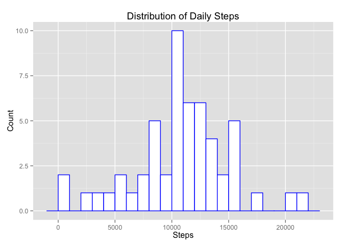
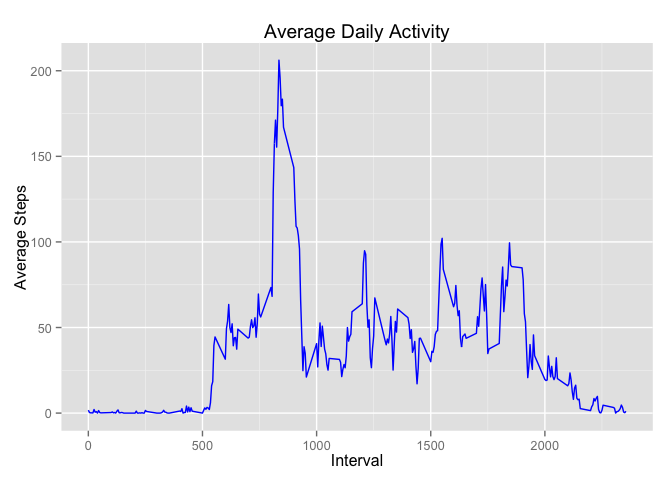
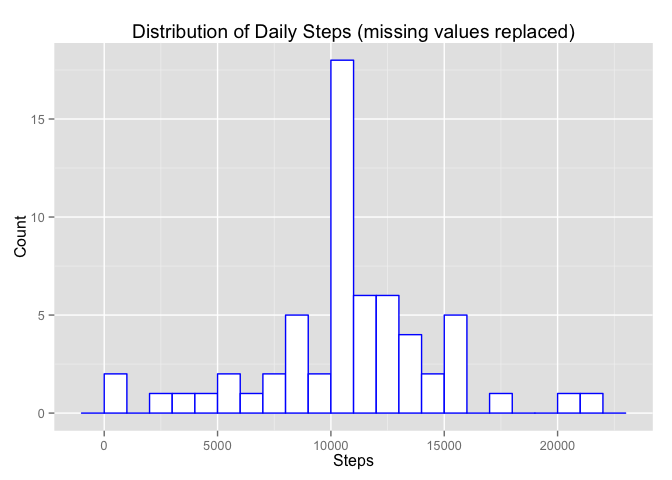
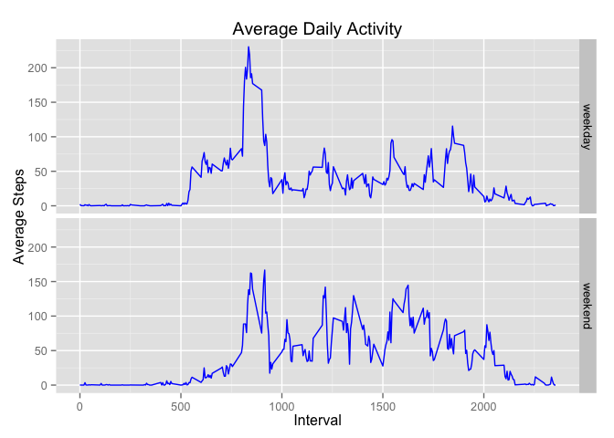

# Reproducible Research: Peer Assessment 1


## Loading and preprocessing the data


```r
unzip('activity.zip', overwrite = TRUE)
data <- read.csv('activity.csv')
```

## What is mean total number of steps taken per day?


```r
library(dplyr)
total_steps_per_day <- data %>%
    group_by(date) %>%
    summarise(total_steps = sum(steps))
```


```r
library(ggplot2)
ggplot(total_steps_per_day, aes(x = total_steps)) +
    geom_histogram(binwidth=1000, color = "blue", fill = "white") +
    labs(title = "Distribution of Daily Steps", x = "Steps", y = "Count")
```

 


```r
mean(total_steps_per_day$total_steps, na.rm = TRUE)
```

```
## [1] 10766.19
```

```r
median(total_steps_per_day$total_steps, na.rm = TRUE)
```

```
## [1] 10765
```

## What is the average daily activity pattern?


```r
ave_steps_by_interval <- data %>%
    group_by(interval) %>%
    summarise(ave_steps = mean(steps, na.rm = TRUE))
ggplot(ave_steps_by_interval, aes(x = interval, y = ave_steps)) +
    geom_line(color = "blue") +
    labs(title = "Average Daily Activity", x = "Interval", y = "Average Steps")
```

 


```r
max_idx <- which.max(ave_steps_by_interval$ave_steps)
max_interval <- ave_steps_by_interval$interval[max_idx]
```

## Imputing missing values

Total number of **missing values**:

```r
sum( is.na(data$steps) )
```

```
## [1] 2304
```

Replace missing values ('NA') with the mean of that 5-minute interval across all days:

```r
data_replace_na <- data %>%
    group_by(interval) %>%
    mutate(steps = ifelse(is.na(steps), mean(steps, na.rm=TRUE), steps))
```


```r
total_steps_per_day_no_na <- data_replace_na %>%
    group_by(date) %>%
    summarise(total_steps = sum(steps))
ggplot(total_steps_per_day_no_na, aes(x = total_steps)) +
    geom_histogram(binwidth=1000, color = "blue", fill = "white") +
    labs(title = "Distribution of Daily Steps (missing values replaced)", x = "Steps", y = "Count")
```

 


```r
mean(total_steps_per_day_no_na$total_steps, na.rm = TRUE)
```

```
## [1] 10766.19
```

```r
median(total_steps_per_day_no_na$total_steps, na.rm = TRUE)
```

```
## [1] 10766.19
```

## Are there differences in activity patterns between weekdays and weekends?


```r
data_replace_na <- data_replace_na %>%
    mutate( day = as.factor( ifelse( weekdays(as.Date(date)) %in% c("Saturday", "Sunday"), "weekend", "weekday" ) ) )
ave_steps_by_interval_no_na <- data_replace_na %>%
    group_by(interval, day) %>%
    summarise(ave_steps = mean(steps, na.rm = TRUE))
ggplot(ave_steps_by_interval_no_na, aes(interval, ave_steps)) +
    geom_line(color = "blue") +
    facet_grid(day ~ .) +
    labs(title = "Average Daily Activity", x = "Interval", y = "Average Steps")
```

 
