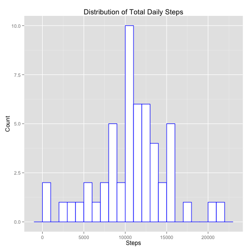
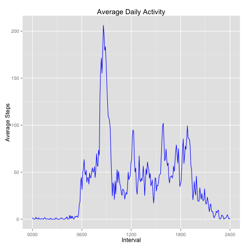
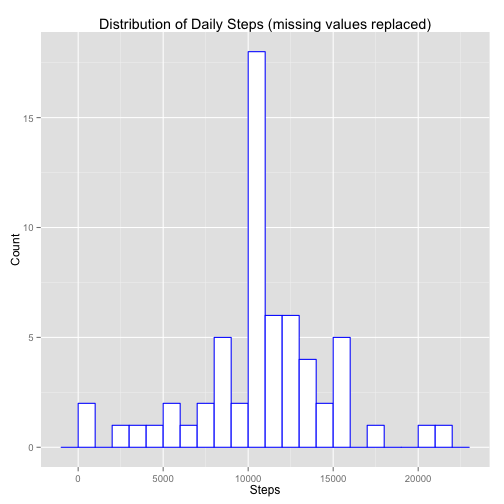
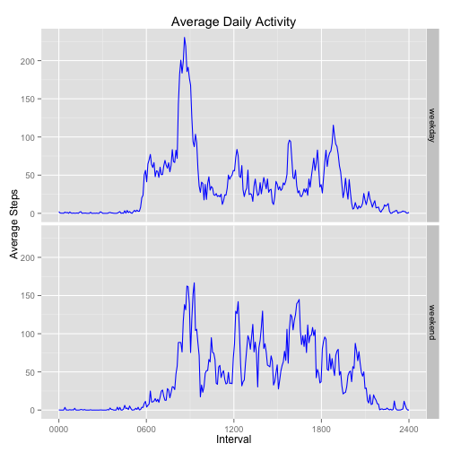

## Loading and preprocessing the data


```r
library(dplyr)
library(ggplot2)

unzip('activity.zip', overwrite = TRUE)
# 'interval' values represent hours/minutes during the day (format of HHMM), meaning
# we can't treat as continuous values (after ..55, values roll to ..00, leaving a gap
# in a continuous scale). Therefore, treat as factor instead.
data <- read.csv('activity.csv', colClasses = c('integer', 'Date', 'integer'))
data$interval <- as.factor(sprintf('%04d', data$interval))
```

## What is mean total number of steps taken per day?


```r
total_steps_per_day <- data %>%
    group_by(date) %>%
    summarise(total_steps = sum(steps))
ggplot(total_steps_per_day, aes(x = total_steps)) +
    geom_histogram(binwidth=1000, color = "blue", fill = "white") +
    labs(title = "Distribution of Total Daily Steps", x = "Steps", y = "Count")
```

 

The **mean** and **median** of the total number of steps taken per day are:

```r
mean(total_steps_per_day$total_steps, na.rm = TRUE)
```

```
## [1] 10766.19
```

```r
median(total_steps_per_day$total_steps, na.rm = TRUE)
```

```
## [1] 10765
```

## What is the average daily activity pattern?


```r
ave_steps_by_interval <- data %>%
    group_by(interval) %>%
    summarise(ave_steps = mean(steps, na.rm = TRUE))

plot_x_labels = c('0000', '0600', '1200', '1800', '2400')
plot_x_breaks = seq(1, 288, along.with = plot_x_labels)

ggplot(ave_steps_by_interval, aes(as.numeric(interval), ave_steps)) +
    geom_line(color = "blue") +
    scale_x_continuous(breaks = plot_x_breaks, labels = plot_x_labels) +
    labs(title = "Average Daily Activity", x = "Interval", y = "Average Steps")
```

 

The **interval** with the most average number of steps across all days:

```r
max_idx <- which.max(ave_steps_by_interval$ave_steps)
max_interval <- ave_steps_by_interval$interval[max_idx]
as.character(max_interval)
```

```
## [1] "0835"
```

## Imputing missing values

Total number of **missing values**:

```r
sum( is.na(data$steps) )
```

```
## [1] 2304
```

Replace missing values ('NA') with the mean of that 5-minute interval across all days:

```r
data_replace_na <- data %>%
    group_by(interval) %>%
    mutate(steps = ifelse(is.na(steps), mean(steps, na.rm=TRUE), steps))
```


```r
total_steps_per_day_no_na <- data_replace_na %>%
    group_by(date) %>%
    summarise(total_steps = sum(steps))
ggplot(total_steps_per_day_no_na, aes(x = total_steps)) +
    geom_histogram(binwidth=1000, color = "blue", fill = "white") +
    labs(title = "Distribution of Daily Steps (missing values replaced)", x = "Steps", y = "Count")
```

 

The **mean** and **median** of the total number of steps taken per day (after replacing missing values) are:

```r
mean(total_steps_per_day_no_na$total_steps, na.rm = TRUE)
```

```
## [1] 10766.19
```

```r
median(total_steps_per_day_no_na$total_steps, na.rm = TRUE)
```

```
## [1] 10766.19
```

After replacing missing values by the average of non-missing values for each interval, the number of days with a total step count at the median increased greatly.

## Are there differences in activity patterns between weekdays and weekends?


```r
data_replace_na <- data_replace_na %>%
    mutate( day = as.factor( ifelse( weekdays(as.Date(date)) %in% c("Saturday", "Sunday"), "weekend", "weekday" ) ) )
ave_steps_by_interval_no_na <- data_replace_na %>%
    group_by(interval, day) %>%
    summarise(ave_steps = mean(steps, na.rm = TRUE))
ggplot(ave_steps_by_interval_no_na, aes(as.numeric(interval), ave_steps)) +
    geom_line(color = "blue") +
    scale_x_continuous(breaks = plot_x_breaks, labels = plot_x_labels) +
    facet_grid(day ~ .) +
    labs(title = "Average Daily Activity", x = "Interval", y = "Average Steps")
```

 

Comparing the average step activity between **weekdays** and **weekends**, there is a noticeable greater concentration of steps on early weekday mornings which isn't as strong on weekends.
